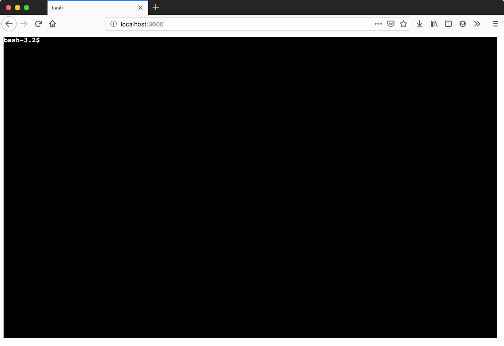
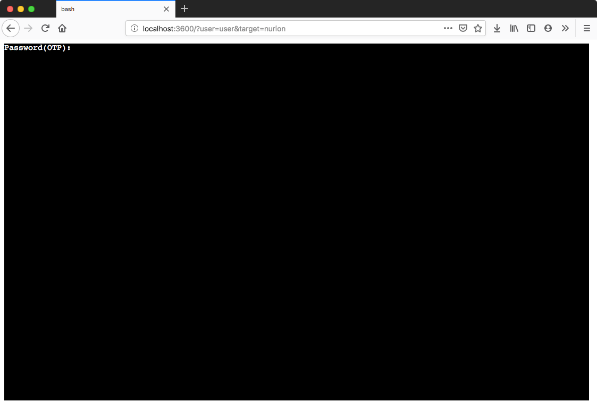

# WebTTY 

## Summary
HTML5 terminal emulation based on Node.js and Linux shell.

## Requirements
* **Linux/macOS with bash/ssh** (Korea Supercomputing System/KSC) installation
* **Node.js V8 Engine** **(DOES NOT WORKING WITH LATEST V10/V12 Engine)** 
To get **V8 Engine**, refer this site: https://nodejs.org/dist/latest-v8.x/  
Tested on CentOS 7/macOS 10.13 High Sierra with v8.16.1
* (Optional) **Python 2** may be required during npm package installation
## Setup

* Common: `npm install` Package installation may be omitted after initial setup.

* Bash: `./node_modules/.bin/tsc ./app.ts && node app.js`

* SSH (KSC): `./node_modules/.bin/tsc ./app-ssh-spawn.ts && node app-ssh-spawn.ts`

## Usage

Web server may be launched on: http://localhost:3600

### Basic Bash launch

### SSH connection to KSC

`user` and `target` must be passed to web server via GET method.

Target List:
* nurion: Knights Landing (KNL) / Skylake (SKL) - Nurion System
* kepler: Kepler GPU - Neuron System
* volta: Volta GPU - Neuron System

Query setup: `http://localhost:3600?user=<user>&target=<target>`

## License
Copyright (c) 2018, David Karapetyan (MIT License). 
Copyright (c) 2019, Seungkyun Hong (MIT License).